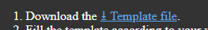
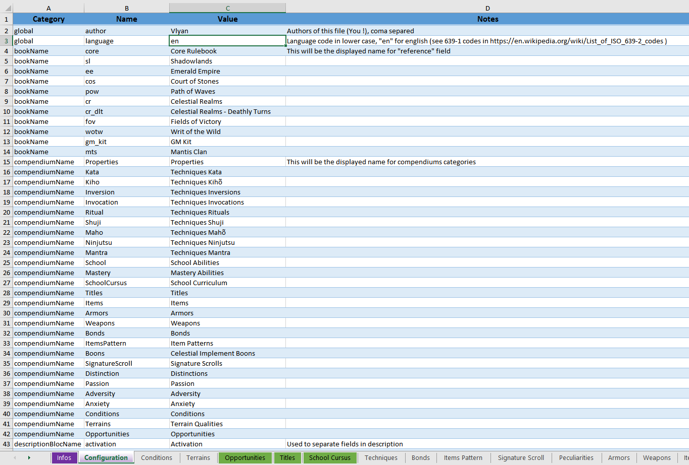
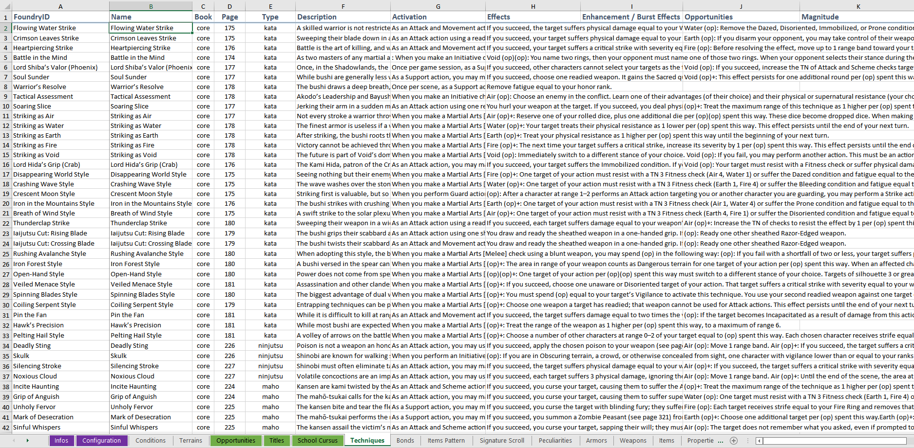
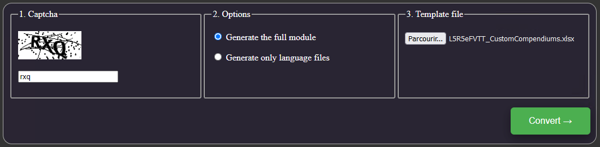
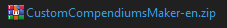
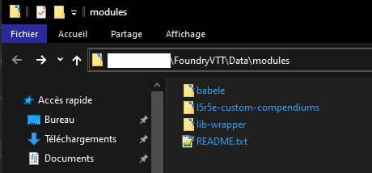
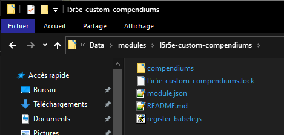
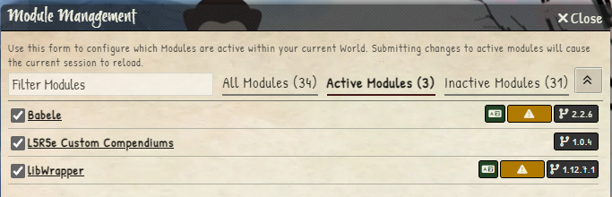
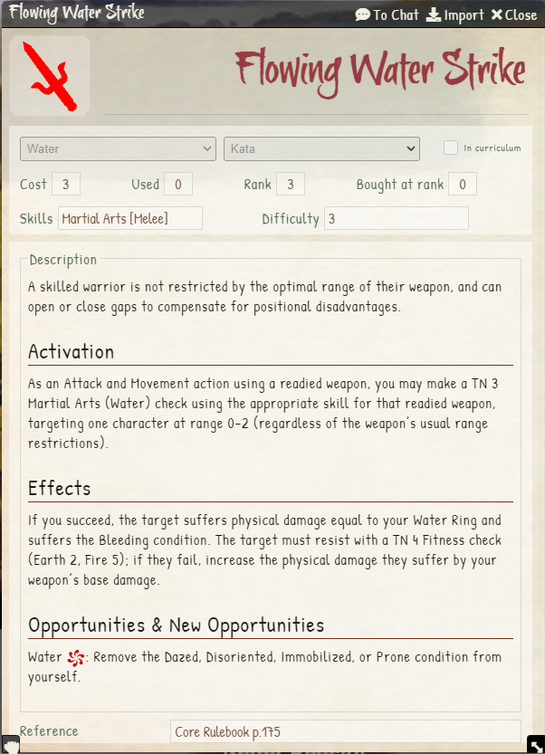

# Compendiums
**Never directly edit the system compendiums**.
They will be erased anytime you update the system.

The best option to keep the links between items and properties for example, is to fill a custom compendium using Babele.
This way, the system compendiums will be overridden by this module.

## Using the Custom Compendiums Maker (recommended)
Here is a quick guide to fill the compendiums with Custom Compendium Maker.

1. Go to the [Custom Compendiums Maker Website](https://vly.yn.lu/l5r5e-custom-compendium-maker/)
2. Download the template file :

3. Open the template file with any software who can open and write an Excel sheet (.xlsx).
4. Check instruction on `Infos` sheet.
5. Go into the `Configuration` sheet, and changes the values in the `Values` column. If your language is `English` you'll probably only need to change the `Author` value.

6. Add the various descriptions on all sheets. Here an example on the `Techniques` sheet :

7. Regularly save the file !
8. When it's done, visit the website again and follow the instructions.

9. Download the generated archive file.

10. Extract it in your FoundryVTT `modules` directory.

11. Open FoundryVTT and load an L5R5e World.
12. Make sure to have all these modules enabled :
    - Babele
    - L5R5e Custom Compendiums
    - LibWrapper

13. Open an item you know you had added a description to see the result :

14. Done, have a good time playing L5R !

## Using the Custom Compendiums Module
You will need to manually download the following module, and edit json files.
Please follow the instructions on :
> https://gitlab.com/teaml5r/l5r5e-custom-compendiums
