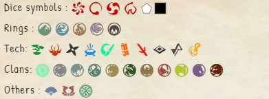

# Symbols replacement list
In sheets or journals, you can use these tags to use symbols :
```
Dice symbols : (op) (su) (ex) (st) (skill) (ring)
Rings : (earth) (water) (fire) (air) (void)
Tech: (kiho) (maho) (ninjutsu) (ritual) (shuji) (invocation) (kata) (prereq) (inversion) (mantra)
Clans: (imperial) (crab) (crane) (dragon) (lion) (mantis) (phoenix) (scorpion) (tortoise) (unicorn) (ronin)
Others : (courtier) (bushi) (shugenja)
```

Result :


